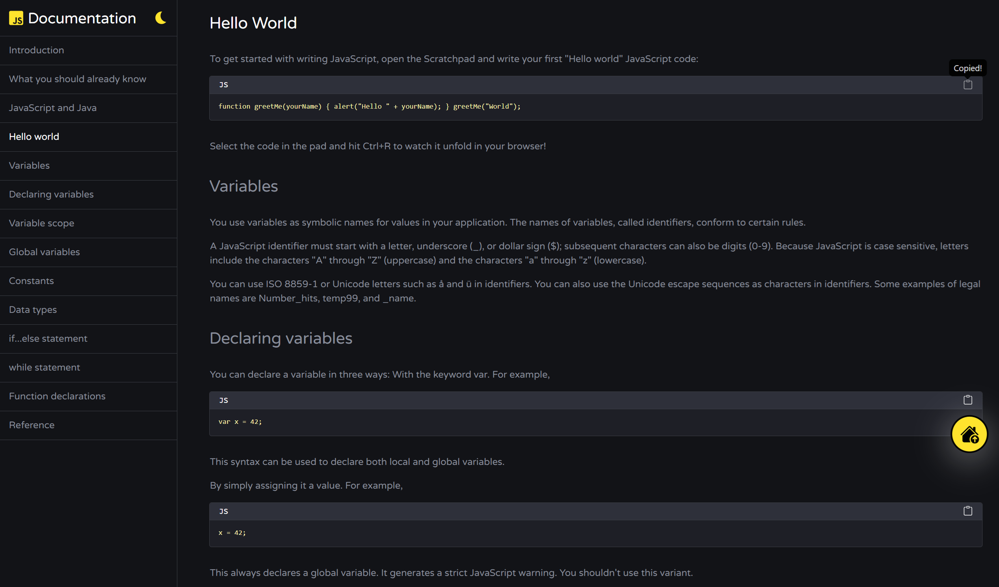
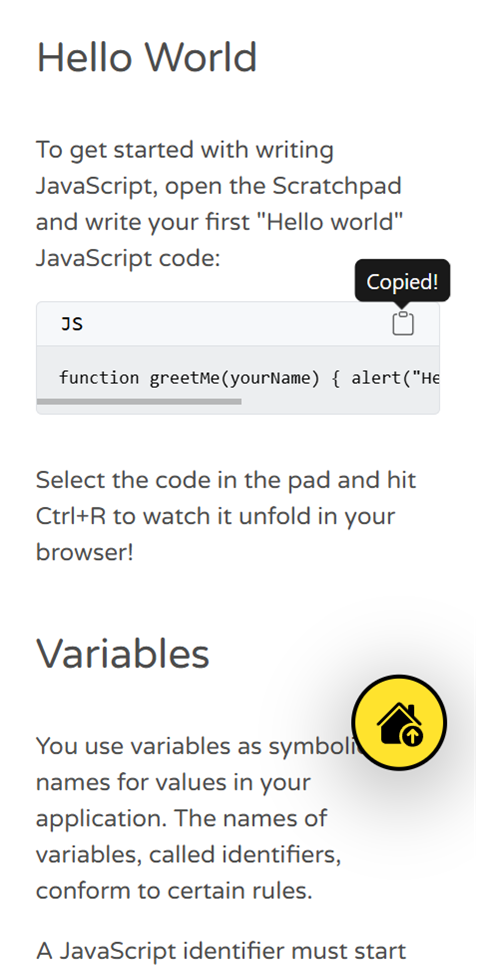
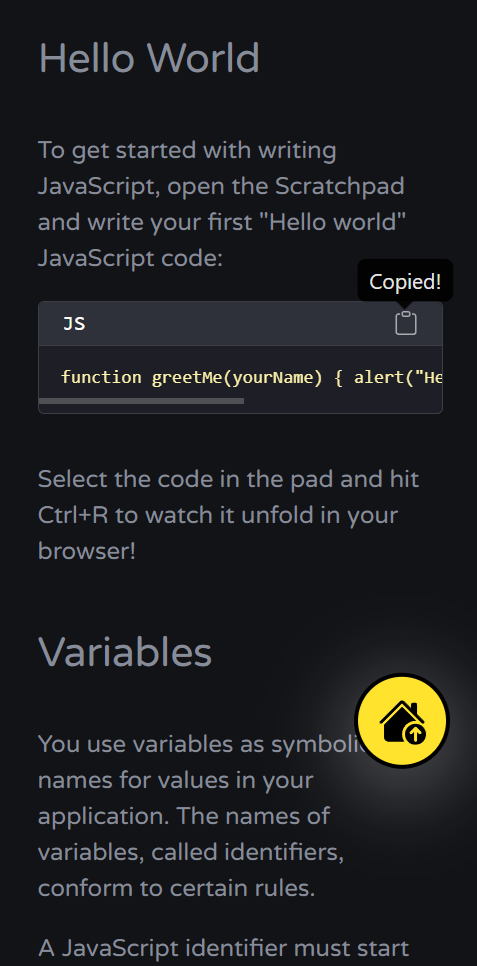
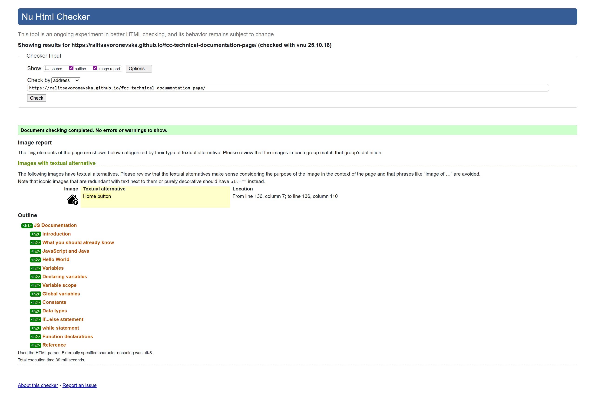
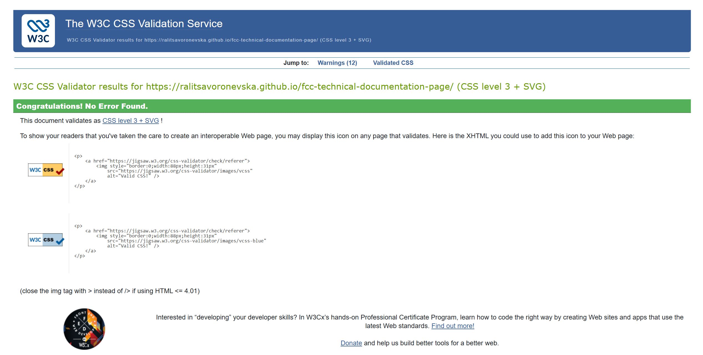
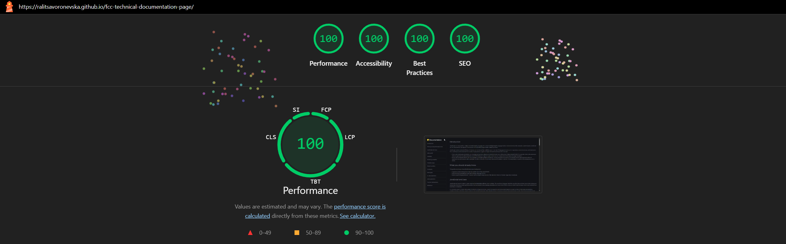
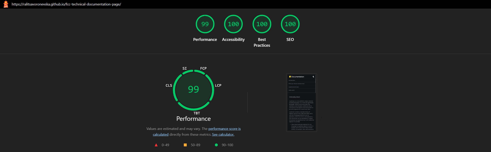
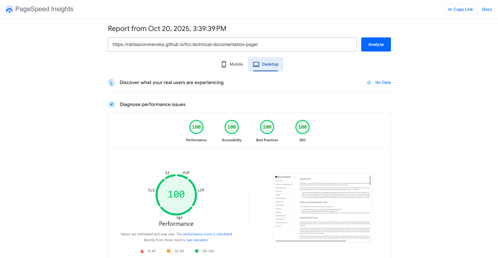
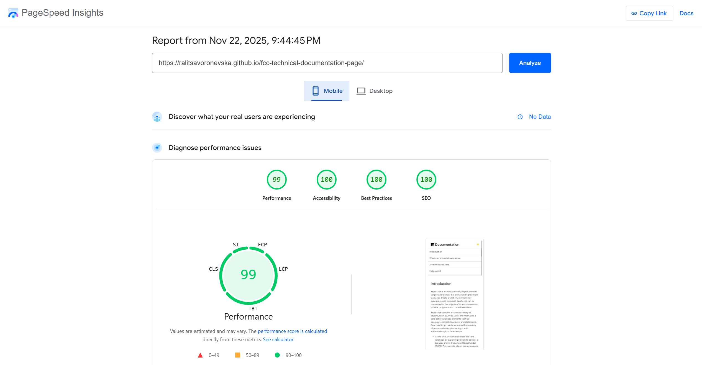

# 🚀 FCC: Build a Technical Documentation Page

📝 [CodePen](https://codepen.io/ralitsavoronevska/pen/zgvWKQ/)
🔗 [Live GitHub Preview](https://ralitsavoronevska.github.io/fcc-technical-documentation-page/)

🎯 FreeCodeCamp Requirements

 

Responsive Web Design Projects - Build a Technical Documentation Page

Objective: Build an app that is functionally similar to https://codepen.io/freeCodeCamp/full/NdrKKL. Do not copy this demo project.

Fulfill the below user stories and get all of the tests to pass. Give it your own personal style.

> You can use HTML, JavaScript, and CSS to complete this project. Plain CSS is recommended because that is what the lessons have covered so far and you should get some practice with plain CSS. You can use Bootstrap or SASS if you choose. Additional technologies (just for example jQuery, React, Angular, or Vue) are not recommended for this project, and using them is at your own risk. Other projects will give you a chance to work with different technology stacks like React. We will accept and try to fix all issue reports that use the suggested technology stack for this project. Happy coding!

✅ User Story #1: I can see a main element with a corresponding id="main-doc", which contains the page's main content (technical documentation).                                                                                                                             
5️⃣ User Story #2: Within the #main-doc element, I can see several section elements, each with a class of main-section. There should be a minimum of 5.                                                                                                                               
ℹ️ User Story #3: The first element within each .main-section should be a header element which contains text that describes the topic of that section.                                                                                                                               
🆔 User Story #4: Each section element with the class of main-section should also have an id that corresponds with the text of each header contained within it. Any spaces should be replaced with underscores (e.g. The section that contains the header "JavaScript and Java" should have a corresponding id="JavaScript_and_Java").                                                                                             
🔟 User Story #5: The .main-section elements should contain at least 10 p elements total (not each).                                        
5️⃣ User Story #6: The .main-section elements should contain at least 5 code elements total (not each).                                     
5️⃣ User Story #7: The .main-section elements should contain at least 5 li items total (not each).                                          
📝 User Story #8: I can see a nav element with a corresponding id="navbar".                                                                 
🧭 User Story #9: The navbar element should contain one header element which contains text that describes the topic of the technical documentation.                                                                                                                              
🔗 User Story #10: Additionally, the navbar should contain link (a) elements with the class of nav-link. There should be one for every element with the class main-section.                                                                                                        
📌 User Story #11: The header element in the navbar must come before any link (a) elements in the navbar.                                   
🔃 User Story #12: Each element with the class of nav-link should contain text that corresponds to the header text within each section (e.g. if you have a "Hello world" section/header, your navbar should have an element which contains the text "Hello world").                   
🏃‍♂️ User Story #13: When I click on a navbar element, the page should navigate to the corresponding section of the main-doc element (e.g. If I click on a nav-link element that contains the text "Hello world", the page navigates to a section element that has that id and contains the corresponding header).                                                                                                         
💻 User Story #14: On regular sized devices (laptops, desktops), the element with id="navbar" should be shown on the left side of the screen and should always be visible to the user.                                                                                        
📱 User Story #15: My Technical Documentation page should use at least one media query.                                                     

You can build your project by forking this [CodePen pen](https://codepen.io/freeCodeCamp/pen/MJjpwO/).
Or you can use this CDN link to run the tests in any environment you like:
https://cdn.freecodecamp.org/testable-projects-fcc/v1/bundle.js.
Once you're done, submit the URL to your working project with all its tests passing.
Remember to use the [Read-Search-Ask](https://www.freecodecamp.org/forum/t/how-to-get-help-when-you-are-stuck/19514/) method if you get stuck.

📸 Screenshots

## 🖥️ Desktop preview:

<table>
  <tr>
    <td colspan="2">📱 Tablet preview:</td>
  </tr>
  <tr>
    <td></td>
    <td></td>
  </tr>
</table>

<table>
  <tr>
    <td colspan="2">📱 Mobile Preview:</td>
  </tr>
  <tr>
    <td></td>
    <td></td>
  </tr>
  <tr>
    <td></td>
    <td></td>
  </tr>
 </table>

 

# 🏅 W3C HTML Validator

 

# 🏅 W3C CSS Validator

 

# 🌈 Chrome LightHouse Audit

Desktop:

 

Mobile:

 

# ⚡ PageSpeed Insights Results

Desktop:

 

Mobile:

  
        
 

# 🛠️ Built with:

                                                                        
          
🔨 SCSS Files [Fully Responsive, Mobile First Approach, Transitions & Flex Layout]                                                               
⛏️ [Google Font: Varela Round](https://fonts.google.com/specimen/Varela+Round/)                                                             
🪓 [Bootstrap v5.3](https://getbootstrap.com/docs/5.3/getting-started/introduction/)                                                        
🪛 [Bootstrap v5.3 Icons](https://icons.getbootstrap.com/)                                                                                  

# ✨ Features:
✅ Modern JavaScript Technical Documentation Page                                                                                            
✅ Fixed sidebar navigation with smooth scroll                                                                                               
✅ toggle-theme button with hover effect                                                                                                     
✅ copy-to-clipboard implementation                                                                                                          
✅ Elegant scroll-to-top button                                                                                                               
✅ manifest.json                                                                                                                                

# 🧰 Online resources and tools:
                                                                                  
🖼️ [Photopea [Online Photo Editor]](https://www.photopea.com/)      
🪄 [svg minification](https://www.svgviewer.dev/)                                                                                               
🌃 [favicon converter](https://favicon.io/favicon-converter/)                                                                                   

# 🌐 Browser Support:
(Last updated and tested: 22/11/2025)                                                                                                                 
🌟 Chrome 142.0.7444.176 (64-bit)                                                                                                                      
🦊 Firefox 145.0.1 (64-bit)                                                                                                                           
🏴‍☠️ Opera 124.0.5705.42 (64-bit)                                                                                                                   
🪟 Edge 142.0.3595.94 (64-bit)                                                                                                                        

# 🧪 Online Validators:
✔️ [W3C HTML Validator](https://validator.w3.org/)                                                                                          
✔️ [W3C CSS Validator](https://jigsaw.w3.org/css-validator/)                                                                           
💡 [LightHouse Audit](https://developers.google.com/web/tools/lighthouse/)                                                                  
⚡ [PageSpeed Insights Audit](https://pagespeed.web.dev/)                                                                                        
⭐ [WebPageTest](https://www.webpagetest.org/)                                                                                               

# 🌟 Inspiration & Credits:
💜 https://trigger.dev                                                                                                                      
📝 https://codepen.io                                                                                                                       
:octocat: https://github.com                                                                                                                
:octocat: https://github.com/twbs/bootstrap/issues/36432                                                                                    
💘 https://web.dev/patterns/theming/theme-switch/#toggle-theme-js                                                                           
✅ https://hollandsweb.com/javascript-tutorial-1-copy-the-text-to-clipboard-using-javascript                                                 
🙌 https://stackoverflow.com/questions/65862446/bootstrap-5-update-tooltip-title-with-javascript/65863062#65863062                          
⭐ https://getbootstrap.com/docs/5.3/getting-started/introduction                                                                            
🎞️ [Fadein and Fadeout Back To Top Button on Page Scroll using CSS and Vanilla JS [YouTube]](https://youtu.be/Pd71ZZeIhaI/)   
🎞️ [11 New CSS Features Every Browser Supports in 2025 [YouTube]](https://www.youtube.com/watch?v=55uUK-iJeNM)                             

---
  
🙌 Thank you for checking out my project! More is coming 🔜.                                                                                           
Stay tuned 🚀 and please don't forget to give the project a star! ⭐                                                                                     
Made with lots of 💗, ☕, and a sprinkle of ✨ by Ralitsa Voronevska!                                                                                
